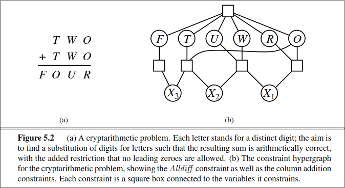

# HTB Cyber Apocalypse 2024

Thank you to the HackTheBox team for hosting this event. Below are writeups for
all the cryptography challenges.

@def maxtoclevel=2
\toc

## Dynastic

We are given a string encrypted with a classical cipher.
```python
from secret import FLAG
from random import randint

def to_identity_map(a):
    return ord(a) - 0x41

def from_identity_map(a):
    return chr(a % 26 + 0x41)

def encrypt(m):
    c = ''
    for i in range(len(m)):
        ch = m[i]
        if not ch.isalpha():
            ech = ch
        else:
            chi = to_identity_map(ch)
            ech = from_identity_map(chi + i)
        c += ech
    return c

with open('output.txt', 'w') as f:
    f.write('Make sure you wrap the decrypted text with the HTB flag format :-]\n')
    f.write(encrypt(FLAG))
```
```plaintext
DJF_CTA_SWYH_NPDKK_MBZ_QPHTIGPMZY_KRZSQE?!_ZL_CN_PGLIMCU_YU_KJODME_RYGZXL
```

From inspecting the code, it looks like the encryption involves mapping each
alphabetic character to the range $[0, 25]$ by subtracting the ASCII code 0x41
for capital A. Then a circular alphabetic shift is applied to each character
before being converted back into proper ASCII character codes. Luckily all the
above operations are invertible, so we can undo the encryption to recover the flag.

```python
#!/usr/bin/env python3

ct = "DJF_CTA_SWYH_NPDKK_MBZ_QPHTIGPMZY_KRZSQE?!_ZL_CN_PGLIMCU_YU_KJODME_RYGZXL"

def to_identity_map_inverse(a):
    return chr(a + 0x41)


pt = ""
for i in range(len(ct)):
    ch = ct[i]
    if not ch.isalpha():
        pt = pt + ch
        continue
    else:
        x = ord(ch) - 0x41
        y = (x - i) % 26
        z = y + 0x41
        pt = pt + chr(z)

print(pt)
```
### Flag
```plaintext
HTB{DID_YOU_KNOW_ABOUT_THE_TRITHEMIUS_CIPHER?!_IT_IS_SIMILAR_TO_CAESAR_CIPHER}
```

## Makeshift
We have a classical cipher which encrypts a message by permuting the characters in a set pattern.
```python
from secret import FLAG

flag = FLAG[::-1]
new_flag = ''

for i in range(0, len(flag), 3):
    new_flag += flag[i+1]
    new_flag += flag[i+2]
    new_flag += flag[i]

print(new_flag)
```
```plaintext
!?}De!e3d_5n_nipaOw_3eTR3bt4{_THB
```
Once again, all the operations are invertible, so we can undo the shuffling to recover the flag.
```python
new_flag = "!?}De!e3d_5n_nipaOw_3eTR3bt4{_THB"

flag = [""] * 100
j = 0
for i in range(0, len(flag), 3):
    flag[i + 1] = new_flag[j]
    j += 1
    flag[i + 2] = new_flag[j]
    j += 1
    flag[i] = new_flag[j]
    j += 1

print("".join(flag)[::-1])
```
### Flag
```plaintext
HTB{4_b3tTeR_w3apOn_i5_n3edeD!?!}
```

## Primary Knowledge
We are given a flag encrypted with an RSA-like encryption scheme, 
\begin{equation*}
c = m^e \pmod n.
\end{equation*}
However unlike regular RSA, $n$ is a prime rather than a product of primes.
This means we can recover $\phi(n) = n - 1$, and $d = e^{-1} \pmod {\phi(n)}$.
Then the plaintext is given by
\begin{equation*}
m = c^d \pmod n.
\end{equation*}

```python
#!/usr/bin/env sage
from Crypto.Util.number import *

n = 144595784022187052238125262458232959109987136704231245881870735843030914418780422519197073054193003090872912033596512666042758783502695953159051463566278382720140120749528617388336646147072604310690631290350467553484062369903150007357049541933018919332888376075574412714397536728967816658337874664379646535347
e = 65537
c = 15114190905253542247495696649766224943647565245575793033722173362381895081574269185793855569028304967185492350704248662115269163914175084627211079781200695659317523835901228170250632843476020488370822347715086086989906717932813405479321939826364601353394090531331666739056025477042690259429336665430591623215

# n is prime
d = inverse_mod(e, n - 1)
m = pow(c, d, n)
print(long_to_bytes(m))
```
### Flag
```plaintext
HTB{0h_d4mn_4ny7h1ng_r41s3d_t0_0_1s_1!!!}
```

## Iced TEA
We are given a ciphertext and the encryption key for a message encrypted with the [TEA cipher](https://en.wikipedia.org/wiki/Tiny_Encryption_Algorithm).
```python
import os
from secret import FLAG
from Crypto.Util.Padding import pad
from Crypto.Util.number import bytes_to_long as b2l, long_to_bytes as l2b
from enum import Enum

class Mode(Enum):
    ECB = 0x01
    CBC = 0x02

class Cipher:
    def __init__(self, key, iv=None):
        self.BLOCK_SIZE = 64
        self.KEY = [b2l(key[i:i+self.BLOCK_SIZE//16]) for i in range(0, len(key), self.BLOCK_SIZE//16)]
        self.DELTA = 0x9e3779b9
        self.IV = iv
        if self.IV:
            self.mode = Mode.CBC
        else:
            self.mode = Mode.ECB
    
    def _xor(self, a, b):
        return b''.join(bytes([_a ^ _b]) for _a, _b in zip(a, b))

    def encrypt(self, msg):
        msg = pad(msg, self.BLOCK_SIZE//8)
        blocks = [msg[i:i+self.BLOCK_SIZE//8] for i in range(0, len(msg), self.BLOCK_SIZE//8)]
        
        ct = b''
        if self.mode == Mode.ECB:
            for pt in blocks:
                ct += self.encrypt_block(pt)
        elif self.mode == Mode.CBC:
            X = self.IV
            for pt in blocks:
                enc_block = self.encrypt_block(self._xor(X, pt))
                ct += enc_block
                X = enc_block
        return ct

    def encrypt_block(self, msg):
        m0 = b2l(msg[:4])
        m1 = b2l(msg[4:])
        K = self.KEY
        msk = (1 << (self.BLOCK_SIZE//2)) - 1

        s = 0
        for i in range(32):
            s += self.DELTA
            m0 += ((m1 << 4) + K[0]) ^ (m1 + s) ^ ((m1 >> 5) + K[1])
            m0 &= msk
            m1 += ((m0 << 4) + K[2]) ^ (m0 + s) ^ ((m0 >> 5) + K[3])
            m1 &= msk
        
        m = ((m0 << (self.BLOCK_SIZE//2)) + m1) & ((1 << self.BLOCK_SIZE) - 1) # m = m0 || m1

        return l2b(m)


if __name__ == '__main__':
    KEY = os.urandom(16)
    cipher = Cipher(KEY)
    ct = cipher.encrypt(FLAG)
    with open('output.txt', 'w') as f:
        f.write(f'Key : {KEY.hex()}\nCiphertext : {ct.hex()}')
```
### Flag
```plaintext
Key : 850c1413787c389e0b34437a6828a1b2
Ciphertext : b36c62d96d9daaa90634242e1e6c76556d020de35f7a3b248ed71351cc3f3da97d4d8fd0ebc5c06a655eb57f2b250dcb2b39c8b2000297f635ce4a44110ec66596c50624d6ab582b2fd92228a21ad9eece4729e589aba644393f57736a0b870308ff00d778214f238056b8cf5721a843
```

Since we know the key, all the operations in the encryption become invertible, so we can implement our own decryption method inside the `Cipher` class
```python
def decrypt(self, msg):
    blocks = [msg[i : i + self.BLOCK_SIZE // 8] for i in range(0, len(msg), self.BLOCK_SIZE // 8)]

    pt = b""
    if self.mode == Mode.ECB:
        for ct in blocks:
            pt += self.decrypt_block(ct)
    elif self.mode == Mode.CBC:
        X = self.IV
        for ct in blocks:
            pt_block = self._xor(X, self.decrypt_block(ct))
            pt += pt_block
            X = ct
    return pt

def decrypt_block(self, msg):
    m0 = b2l(msg[:4])
    m1 = b2l(msg[4:])
    K = self.KEY
    msk = (1 << (self.BLOCK_SIZE // 2)) - 1
    s = 84941944608
    for i in range(32):
        m1 -= ((m0 << 4) + K[2]) ^ (m0 + s) ^ ((m0 >> 5) + K[3])
        m1 = m1 % (msk + 1)
        m0 -= ((m1 << 4) + K[0]) ^ (m1 + s) ^ ((m1 >> 5) + K[1])
        m0 = m0 % (msk + 1)
        s -= self.DELTA
    return l2b(m0) + l2b(m1)
```
From there, we can decrypt the given key-ciphertext pair to obtain the flag.
```python
KEY = bytes.fromhex("850c1413787c389e0b34437a6828a1b2")
CIPHERTEXT = bytes.fromhex(
    "b36c62d96d9daaa90634242e1e6c76556d020de35f7a3b248ed71351cc3f3da97d4d8fd0ebc5c06a655eb57f2b250dcb2b39c8b2000297f635ce4a44110ec66596c50624d6ab582b2fd92228a21ad9eece4729e589aba644393f57736a0b870308ff00d778214f238056b8cf5721a843"
)
cipher = Cipher(KEY)
pt = cipher.decrypt(CIPHERTEXT)
```
### Flag
```plaintext
HTB{th1s_1s_th3_t1ny_3ncryp710n_4lg0r1thm_____y0u_m1ght_h4v3_4lr34dy_s7umbl3d_up0n_1t_1f_y0u_d0_r3v3rs1ng}
```

## Blunt
We are given the public outputs from a finite field Diffie-Hellman exchange.
```python
from Crypto.Cipher import AES
from Crypto.Util.Padding import pad
from Crypto.Util.number import getPrime, long_to_bytes
from hashlib import sha256

from secret import FLAG

import random


p = getPrime(32)
print(f'p = 0x{p:x}')

g = random.randint(1, p-1)
print(f'g = 0x{g:x}')

a = random.randint(1, p-1)
b = random.randint(1, p-1)

A, B = pow(g, a, p), pow(g, b, p)

print(f'A = 0x{A:x}')
print(f'B = 0x{B:x}')

C = pow(A, b, p)
assert C == pow(B, a, p)

# now use it as shared secret
hash = sha256()
hash.update(long_to_bytes(C))

key = hash.digest()[:16]
iv = b'\xc1V2\xe7\xed\xc7@8\xf9\\\xef\x80\xd7\x80L*'
cipher = AES.new(key, AES.MODE_CBC, iv)

encrypted = cipher.encrypt(pad(FLAG, 16))
print(f'ciphertext = {encrypted}')
```
Note that the size of the prime modulus $p$ is unusually small (only 32-bits).
This suggests that we should be able to recover the shared secret by solving the
discrete log problem.

```python
#!/usr/bin/env sage
from Crypto.Cipher import AES
from Crypto.Util.Padding import pad
from Crypto.Util.number import getPrime, long_to_bytes
from hashlib import sha256

ciphertext = b"\x94\x99\x01\xd1\xad\x95\xe0\x13\xb3\xacZj{\x97|z\x1a(&\xe8\x01\xe4Y\x08\xc4\xbeN\xcd\xb2*\xe6{"

p = 0xDD6CC28D
K = GF(p)
g = K(0x83E21C05)
A = K(0xCFABB6DD)
B = 0xC4A21BA9

a = A.log(g)
C = pow(B, a, p)

# now use it as shared secret
hash = sha256()
hash.update(long_to_bytes(C))

key = hash.digest()[:16]
iv = b"\xc1V2\xe7\xed\xc7@8\xf9\\\xef\x80\xd7\x80L*"
cipher = AES.new(key, AES.MODE_CBC, iv)

decrypted = cipher.decrypt(ciphertext)
print(decrypted)
```
### Flag
```plaintext
HTB{y0u_n3ed_a_b1gGeR_w3ap0n!!}
```

## Arranged
This challenge is similar to the previous challenge. Here we are given the public outputs to an elliptic curve Diffie-Hellman exchange.
```python
from Crypto.Cipher import AES
from Crypto.Util.Padding import pad
from Crypto.Util.number import long_to_bytes
from hashlib import sha256

from secret import FLAG, p, b, priv_a, priv_b

F = GF(p)
E = EllipticCurve(F, [726, b])
G = E(926644437000604217447316655857202297402572559368538978912888106419470011487878351667380679323664062362524967242819810112524880301882054682462685841995367, 4856802955780604241403155772782614224057462426619061437325274365157616489963087648882578621484232159439344263863246191729458550632500259702851115715803253)

A = G * priv_a
B = G * priv_b

print(A)
print(B)

C = priv_a * B

assert C == priv_b * A

# now use it as shared secret
secret = C[0]

hash = sha256()
hash.update(long_to_bytes(secret))

key = hash.digest()[16:32]
iv = b'u\x8fo\x9aK\xc5\x17\xa7>[\x18\xa3\xc5\x11\x9en'
cipher = AES.new(key, AES.MODE_CBC, iv)

encrypted = cipher.encrypt(pad(FLAG, 16))
print(encrypted)
```
The elliptic curve $E$ is given by the Weierstrass equation 
\begin{equation*}
y^2 = x^3 + 726x + b \pmod p
\end{equation*}
where the parameters $b$ and $p$ are unknown. Fortunately we know three points
$A = (a_x, a_y), B = (b_x, b_y)$ and $G = (g_x, g_y)$ which lie on the curve, so
we know that at least over $\mathbb{Z}$ the following equations hold
\begin{align*}
a_y^2 &= a_x^3 + 726a_x + b + k_1p\\
b_y^2 &= b_x^3 + 726b_x + b + k_2p\\
g_y^2 &= g_x^3 + 726g_x + b + k_3p,\\
\end{align*} where $k_1, k_2, k_3 \in \mathbb{Z}$. Observe that for $i \neq j$ we have
\begin{equation*}
b+k_ip - b+k_jp = p(k_i - k_j),
\end{equation*} and so we have good chances at recovering $p$ as
\begin{equation*}
\mathrm{gcd}\left(p(k_1 - k_2), p(k_2 - k_3), p(k_3 - k_1)\right).
\end{equation*} Once we know $p$, then we can recover $b$ as 
\begin{equation*}
b = a_y^2 - a_x^3 - 726a_x \pmod p
\end{equation*}
```python
#!/usr/bin/env sage
from Crypto.Cipher import AES
from Crypto.Util.Padding import pad
from Crypto.Util.number import long_to_bytes
from hashlib import sha256
import itertools

A = (
    6174416269259286934151093673164493189253884617479643341333149124572806980379124586263533252636111274525178176274923169261099721987218035121599399265706997,
    2456156841357590320251214761807569562271603953403894230401577941817844043774935363309919542532110972731996540328492565967313383895865130190496346350907696,
)
B = (
    4226762176873291628054959228555764767094892520498623417484902164747532571129516149589498324130156426781285021938363575037142149243496535991590582169062734,
    425803237362195796450773819823046131597391930883675502922975433050925120921590881749610863732987162129269250945941632435026800264517318677407220354869865,
)
G = (
    926644437000604217447316655857202297402572559368538978912888106419470011487878351667380679323664062362524967242819810112524880301882054682462685841995367,
    4856802955780604241403155772782614224057462426619061437325274365157616489963087648882578621484232159439344263863246191729458550632500259702851115715803253,
)
ciphertext = b'V\x1b\xc6&\x04Z\xb0c\xec\x1a\tn\xd9\xa6(\xc1\xe1\xc5I\xf5\x1c\xd3\xa7\xdd\xa0\x84j\x9bob\x9d"\xd8\xf7\x98?^\x9dA{\xde\x08\x8f\x84i\xbf\x1f\xab'

b_k1p = A[1]^2 - A[0]^3 - 726*A[0]
b_k2p = B[1]^2 - B[0]^3 - 726*B[0]
b_k3p = G[1]^2 - G[0]^3 - 726*G[0]

samples = []
for a, b in itertools.combinations([b_k1p, b_k2p, b_k3p], 2):
    samples.append(b - a)

for a, b in itertools.combinations(samples, 2):
    print(GCD(a, b))

p = GCD(samples[0], samples[1])

F = GF(p)
b = F(A[1])^2 - F(A[0])^3 - 726*F(A[0])
E = EllipticCurve(F, [726, b])
```

From here, we observe that the order of $G$ in the elliptic curve group is very
small (only 11). Hence we can easily solve the discrete log problem to break the
ECDH exchange.
```python
ciphertext = b'V\x1b\xc6&\x04Z\xb0c\xec\x1a\tn\xd9\xa6(\xc1\xe1\xc5I\xf5\x1c\xd3\xa7\xdd\xa0\x84j\x9bob\x9d"\xd8\xf7\x98?^\x9dA{\xde\x08\x8f\x84i\xbf\x1f\xab'
G = E(926644437000604217447316655857202297402572559368538978912888106419470011487878351667380679323664062362524967242819810112524880301882054682462685841995367, 4856802955780604241403155772782614224057462426619061437325274365157616489963087648882578621484232159439344263863246191729458550632500259702851115715803253)
n = G.order()                   # n = 11
A = E(A)
B = E(B)
priv_a = discrete_log(A, G, 11, operation='+') # priv_a = 4

C = B * priv_a
# now use it as shared secret
secret = C[0]

hash = sha256()
hash.update(long_to_bytes(int(secret)))

key = hash.digest()[16:32]
iv = b'u\x8fo\x9aK\xc5\x17\xa7>[\x18\xa3\xc5\x11\x9en'
cipher = AES.new(key, AES.MODE_CBC, iv)

decrypted = cipher.decrypt(ciphertext)
print(decrypted)
```
### Flag
```plaintext
HTB{0rD3r_mUsT_b3_prEs3RveD_!!@!}
```

## Partial Tenacity
In this challenge, we are tasked with recoving the factors $p$, $q$ of an RSA private key so that $pq = n$. To assist us, we are provided with partial knowledge of $p$ and $q$, namely we know all the even-indexed digits of $p$ in base 10, and all the odd-indexed digits of $q$ in base 10.
```python
from secret import FLAG
from Crypto.PublicKey import RSA
from Crypto.Cipher import PKCS1_OAEP


class RSACipher:
    def __init__(self, bits):
        self.key = RSA.generate(bits)
        self.cipher = PKCS1_OAEP.new(self.key)

    def encrypt(self, m):
        return self.cipher.encrypt(m)

    def decrypt(self, c):
        return self.cipher.decrypt(c)


enc_flag = cipher.encrypt(FLAG)

with open("output.txt", "w") as f:
    f.write(f"n = {cipher.key.n}\n")
    f.write(f"ct = {enc_flag.hex()}\n")
    f.write(f"p = {str(cipher.key.p)[::2]}\n")
    f.write(f"q = {str(cipher.key.q)[1::2]}")
```
This setup reminded me of one of those classic cryptarithmetic problems, which (alongside [map colourings of Australia](http://aima.cs.berkeley.edu/newchap05.pdf)) is burned into my brain as a prototypical example of a constraint satisfaction problem.
@@invert_image

@@
Because of this, I decided to attack this challenge using a constraint
programming approach. 

We model each of the digits in $p, q$ and $n$ with integer variables 
$P_i, Q_i, N_i$ where the subscript $i$ is ordered in increasing order from least significant to most significant digits. If we know the exact value of a particular digit, then we impose a constraint that the digit takes on its known value. Otherwise we only constrain each variable to lie within the interval $[0, 9]$.

The construction of the constraints follows the long multiplication pen and paper algorithm for multipling two numbers. Let $T$ be a matrix of sufficient size which contains the tableau of intermediate digits normally produced during long multiplication. This matrix is indexed from top-right to bottom left, so that for example, the letters $R, U, O, F$ in the above image have indices $(1,1)$, $(1, 2)$, $(1, 3)$, $(1, 4)$ respectively in $T$.

Assuming the multiplication proceeds with $p$ above and $q$ below, the multiplication phase of the algorithm begins with multiplying each digit of $p$ with the least significant digit of $q$. The result of this process forms the first row of the tableau. We then repeat the process, this time multiplying each digit of $p$ with the second digit of $q$ and writing the results of the multiplications into the second row, albeit shifted over by one space to the left.

As an example, consider what happens during the multiplication of $P_1$ and $Q_1$. Since both are digits within 0 to 9, their product is bounded above by 81, and so we can write
\begin{equation*}
P_1 \cdot Q_1 = 10X + Y
\end{equation*}
where $X$ and $Y$ are new integer variables bound between 0 and 9. The variable $Y$ will be inserted into the tableau at position $(1, 1)$, and the variable $X$ will be retained as the "carry" resulting from the multiplication of $P_1$ and $Q_1$. The next multiplication to take place is between $P_2$ and $Q_1$. Again, since $P_2$ and $Q_1$ are bounded above by 9, then $P_2 \cdot Q_1$ is bounded above by 81 and so $P_2 \cdot Q_1 + X$ is bounded above by 90. Hence we can write 
\begin{equation*}
P_2 \cdot Q_1 + X = 10X' + Y'
\end{equation*} where $X',Y'$ are once again integer variables representing digits from 0 to 9. Like before, $Y'$ is written into the tableau at position $(1, 2)$, and $X'$ is retained as the carry resulting from the multiplication. Once we reach the last multiplication on this row, the carry is not retained, and is instead written into the tableau at the leftmost position of the row.

Repeating the above process, we finish the multiplication phase of the algorithm and now have a completed tableau. Now we move onto the addition phase, where we sum up each column, and impose a constraint that the least 
significant digit of the sum must match the corresponding digit in $n$. For example, in the sum of the right-most tableau column, we have
\begin{equation*}
\sum_{j}T[1, j] = 10X'' + Y''.
\end{equation*}
This time, both $X''$ and $Y''$ are integral, but we require only $Y''$ to be a base-10 digit since the carry resulting from addition could be greater than 9. We impose the constraint that $Y'' = N_1$, and retain $X''$ as the carry resulting from additon of the first tableau column. Repeating the above process for each column, we complete the long multiplication algorithm and have specified all the required constraints to model $pq = n$ in base-10 arithmetic.


Below is an implementation of the above model, using Julia's interface to the [MiniZinc
modelling language](https://www.minizinc.org) and 
[chuffed](https://github.com/chuffed/chuffed) as the backend solver.
```julia
import MiniZinc
import MathOptInterface as MOI

const N =
  118641897764566817417551054135914458085151243893181692085585606712347004549784923154978949512746946759125187896834583143236980760760749398862405478042140850200893707709475167551056980474794729592748211827841494511437980466936302569013868048998752111754493558258605042130232239629213049847684412075111663446003
const P = 151441473357136152985216980397525591305875094288738820699069271674022167902643

const Q = 15624342005774166525024608067426557093567392652723175301615422384508274269305


function add_digit_constraints(model, digits, variables)
  for (i, digit) in enumerate(digits)
    if digit === :unknown     # unknown digit, add interval constraint
      MOI.add_constraint(model, variables[i], MOI.Interval(0, 9))
    else                      # known digit, tell model explicitly
      MOI.add_constraint(model, variables[i], MOI.EqualTo(digit))
    end
  end
end

function solve_using_carry(P, Q, N)
  model = MOI.Utilities.CachingOptimizer(
    MiniZinc.Model{Int}(),
    MiniZinc.Optimizer{Int}("chuffed"),
  )
  p = MOI.add_variables(model, length(P))

  q = MOI.add_variables(model, length(Q))

  MOI.add_constraint.(model, p, MOI.Integer())
  MOI.add_constraint.(model, q, MOI.Integer())

  add_digit_constraints(model, P, p)
  add_digit_constraints(model, Q, q)

  target = digits(N)

  tableau = Matrix{Any}(zeros(Int64, (length(p) + length(q), length(p) + length(q))))
  for q_index = 1:length(q)
    for p_index = 1:length(p)
      x, y = MOI.add_variables(model, 2)
      MOI.add_constraint.(model, x, MOI.Integer())
      MOI.add_constraint(model, x, MOI.Interval(0, 9))
      MOI.add_constraint.(model, y, MOI.Integer())
      MOI.add_constraint(model, y, MOI.Interval(0, 9))

      # p[i] * q[j] + carry[i, j] = 10x + y
      MOI.add_constraint(
        model,
        1 * p[p_index] * q[q_index] + tableau[q_index, p_index+q_index-1] - 10 * x - y,
        MOI.EqualTo(0),
      )
      tableau[q_index, p_index+q_index-1] = y # significand
      tableau[q_index, p_index+q_index] = x # carry
    end
  end

  carry = 0
  for (col, target_digit) in zip(eachcol(tableau), target)
    col_sum = sum(col; init = 0)
    x, y = MOI.add_variables(model, 2)
    MOI.add_constraint.(model, x, MOI.Integer()) # x does not have to be within 0-9
    MOI.add_constraint.(model, y, MOI.Integer())
    MOI.add_constraint(model, y, MOI.Interval(0, 9))

    # sum(column) + carry = 10x + y
    MOI.add_constraint(model, 1 * col_sum + carry - 10 * x - y, MOI.EqualTo(0))
    # y = target_digit
    MOI.add_constraint(model, 1 * y - target_digit, MOI.EqualTo(0))
    carry = x
  end

  MOI.optimize!(model)
  p_star = MOI.get(model, MOI.VariablePrimal(), p)
  q_star = MOI.get(model, MOI.VariablePrimal(), q)

  p = evalpoly(big(10), p_star)
  q = evalpoly(big(10), q_star)

  @show p * q == N

  return p, q
end


function solve()
  p = digits(P)
  q = digits(Q)

  p_original = reduce(vcat, ([d, :unknown] for d in reverse(p)))[1:end-1]
  q_original = reduce(vcat, ([:unknown, d] for d in reverse(q)))
  push!(q_original, :unknown)

  @show length(p_original)
  @show length(q_original)
  p_original = reverse(p_original)
  q_original = reverse(q_original)

  @show p_original
  @show q_original

  p, q = solve_using_carry(p_original, q_original, N)

  # p = 10541549431842783633587614316112542499895727166990860537947158205451961334065983715903944224868775308489240169949600619123741969714205272515647199022167453
  # q = 11254692541324720060752707148186767582750062945630785066774422168535575089335596479399029695524722638167959390210621853422825328846580189277644256392390351
end

```
From here, we know both $p$ and $q$, and so we can reconstruct the RSA private key and decrypt the flag.
```python
#!/usr/bin/env sage

from Crypto.PublicKey import RSA
from Crypto.Cipher import PKCS1_OAEP
from Crypto.Util.number import *
from Crypto.PublicKey.RSA import RsaKey

n = 118641897764566817417551054135914458085151243893181692085585606712347004549784923154978949512746946759125187896834583143236980760760749398862405478042140850200893707709475167551056980474794729592748211827841494511437980466936302569013868048998752111754493558258605042130232239629213049847684412075111663446003
ct = bytes.fromhex(
    "7f33a035c6390508cee1d0277f4712bf01a01a46677233f16387fae072d07bdee4f535b0bd66efa4f2475dc8515696cbc4bc2280c20c93726212695d770b0a8295e2bacbd6b59487b329cc36a5516567b948fed368bf02c50a39e6549312dc6badfef84d4e30494e9ef0a47bd97305639c875b16306fcd91146d3d126c1ea476"
)

# Found using solve.jl
p = 10541549431842783633587614316112542499895727166990860537947158205451961334065983715903944224868775308489240169949600619123741969714205272515647199022167453
q = 11254692541324720060752707148186767582750062945630785066774422168535575089335596479399029695524722638167959390210621853422825328846580189277644256392390351

e = 65537
d = inverse_mod(e, lcm(p - 1, q - 1))
key = RSA.construct((int(n), int(e), int(d), int(p), int(q), int(inverse_mod(p, q))))


class RSACipher:
    def __init__(self, key):
        self.key = key
        self.cipher = PKCS1_OAEP.new(self.key)

    def encrypt(self, m):
        return self.cipher.encrypt(m)

    def decrypt(self, c):
        return self.cipher.decrypt(c)


cipher = RSACipher(key)
pt = cipher.decrypt(ct)
```
```flag
HTB{v3r1fy1ng_pr1m3s_m0dul0_p0w3rs_0f_10!}
```
## Permuted
We have another Diffie-Hellman challenge, this time over the symmetric group $S_n$ for $n = 50,000$.
```python
from Crypto.Cipher import AES
from Crypto.Util.Padding import pad
from Crypto.Util.number import long_to_bytes

from hashlib import sha256
from random import shuffle

from secret import a, b, FLAG

class Permutation:
    def __init__(self, mapping):
        self.length = len(mapping)

        assert set(mapping) == set(range(self.length))     # ensure it contains all numbers from 0 to length-1, with no repetitions
        self.mapping = list(mapping)

    def __call__(self, *args, **kwargs):
        idx, *_ = args
        assert idx in range(self.length)
        return self.mapping[idx]

    def __mul__(self, other):
        ans = []

        for i in range(self.length):
            ans.append(self(other(i)))

        return Permutation(ans)

    def __pow__(self, power, modulo=None):
        ans = Permutation.identity(self.length)
        ctr = self

        while power > 0:
            if power % 2 == 1:
                ans *= ctr
            ctr *= ctr
            power //= 2

        return ans

    def __str__(self):
        return str(self.mapping)

    def identity(length):
        return Permutation(range(length))


x = list(range(50_000))
shuffle(x)

g = Permutation(x)
print('g =', g)

A = g**a
print('A =', A)
B = g**b
print('B =', B)

C = A**b
assert C.mapping == (B**a).mapping

sec = tuple(C.mapping)
sec = hash(sec)
sec = long_to_bytes(sec)

hash = sha256()
hash.update(sec)

key = hash.digest()[16:32]
iv = b"mg'g\xce\x08\xdbYN2\x89\xad\xedlY\xb9"

cipher = AES.new(key, AES.MODE_CBC, iv)

encrypted = cipher.encrypt(pad(FLAG, 16))
print('c =', encrypted)
```

Rather than working with the `Permutation` class provided by the challenge, we
will use the `make_permgroup_element_v2` function of SageMath to convert the
group elements into Sage's native representation. This way we will have access to the
full suite of SageMath's algebraic functionality when solving this challenge.
```python
#!/usr/bin/env sage

from Crypto.Cipher import AES
from Crypto.Util.Padding import pad
from Crypto.Util.number import long_to_bytes

from hashlib import sha256
from random import shuffle

from sage.groups.perm_gps.permgroup_element import make_permgroup_element_v2

# Pasting output.txt into the script crashes emacs :<
exec(compile(open("output.txt").read(), "output.py", "exec"))

# Convert g into SageMath representation
S = SymmetricGroup(range(50_000))
g = make_permgroup_element_v2(S, g, S.domain())

```
From here, `g.order()` reveals to us the order of the generator.
Looking the order up on `factordb`, we find that it admits a very smooth factorisation
\begin{equation*}
2^2 \cdot 3^3 \cdot 5^2 \cdot 7 \cdot 11 \cdot 13 \cdot 23^2 \cdot 47 \cdot 53 \cdot 101 \cdot 149 \cdot 163 \cdot 379,
\end{equation*} so we can expect the Pohlig-Hellman algorithm to perform well here.

```python
n = g.order()  # 3311019189498977856900 
A = make_permgroup_element_v2(S, A, S.domain())
a = discrete_log(A, g, n, operation="*")  # 839949590738986464

B = Permutation(B)
C = B**a
sec = tuple(C.mapping)
sec = hash(sec)
sec = long_to_bytes(sec)

hash = sha256()
hash.update(sec)
key = hash.digest()[16:32]
iv = b"mg'g\xce\x08\xdbYN2\x89\xad\xedlY\xb9"

cipher = AES.new(key, AES.MODE_CBC, iv)
decrypted = cipher.decrypt(c)
print(decrypted)
```
### Flag
```plaintext
HTB{w3lL_n0T_aLl_gRoUpS_aRe_eQUaL_!!}
```

## Tsayaki
This challenge asks us to return to the TEA cipher from the [Iced
TEA](/ctf/htbroyale24/#iced_tea) challenge above and to answer the following challenge: given a fixed plaintext
$P$, produce 4 keys such that the encryption of $P$ under
each of the keys results in the same ciphertext. To prove that we did not just
get lucky, we must repeat the process across 10 rounds with different
ciphertexts and key quadruplets.

```python
from tea import Cipher as TEA
from secret import IV, FLAG
import os

ROUNDS = 10

def show_menu():
    print("""
============================================================================================
|| I made this decryption oracle in which I let users choose their own decryption keys.   ||
|| I think that it's secure as the tea cipher doesn't produce collisions (?) ... Right?   ||
|| If you manage to prove me wrong 10 times, you get a special gift.                      ||
============================================================================================
""")

def run():
    show_menu()

    server_message = os.urandom(20)
    print(f'Here is my special message: {server_message.hex()}')
    
    used_keys = []
    ciphertexts = []
    for i in range(ROUNDS):
        print(f'Round {i+1}/10')
        try:
            ct = bytes.fromhex(input('Enter your target ciphertext (in hex) : '))
            assert ct not in ciphertexts

            for j in range(4):
                key = bytes.fromhex(input(f'[{i+1}/{j+1}] Enter your encryption key (in hex) : '))
                assert len(key) == 16 and key not in used_keys
                used_keys.append(key)
                cipher = TEA(key, IV)
                enc = cipher.encrypt(server_message)
                if enc != ct:
                    print(f'Hmm ... close enough, but {enc.hex()} does not look like {ct.hex()} at all! Bye...')
                    exit()
        except:
            print('Nope.')
            exit()
            
        ciphertexts.append(ct)

    print(f'Wait, really? {FLAG}')


if __name__ == '__main__':
    run()
```

Researching the TEA cipher on Wikipedia, I was led to a paper by [Kelsey, Schneier and Wagner](https://web.archive.org/web/20120208081900/http://www.schneier.com/paper-key-schedule.pdf) which mentions a key equivalence vulnerability in TEA. In particular, the round function $F$ in the $i$-th round of the encryption is given by
\begin{equation*}
F_i(z, k, k') = (\mathrm{ShiftLeft}(z, 4) + k) \oplus (z + C_i) \oplus (\mathrm{ShiftRight}(z, 5) + k')
\end{equation*} where:
- $z$ is the 4-byte block the round function is being applied to (`m0` or `m1` in the challenge source code),
- $C_i$ is a counter (`s` in the challenge source code) 
- $k, k'$ are the high 4-bytes and low 4-bytes of the key material being applied in that round (`K[0], K[1]`, or `K[2], K[3]` in the challenge source code)

Observe that if the most significant bits of $k$ and $k'$ were flipped, then since bit-flips to the MSB are preserved under addition, both the $(\mathrm{ShiftLeft}(z, 4) + k)$ and the
$(\mathrm{ShiftRight}(z, 5) + k')$ terms would experience a single bit flip in their most significant bit. When they get XOR'd together, this bit-flip cancels out, and so the round function with respect to the altered keys is identical to the round function with respect to the original keys. Hence, given a key $K$ made up of four 4-byte words $K = K_1\Vert K_2\Vert K_3\Vert K_4$, the following keys
- $K_1 \Vert K_2 \Vert K_3 \Vert K_4$
- $\mathrm{FlipMSB}(K_1) \Vert \mathrm{FlipMSB}(K_2) \Vert K_3 \Vert K_4$
- $K_1 \Vert K_2 \Vert \mathrm{FlipMSB}(K_3) \Vert \mathrm{FlipMSB}(K_4)$
- $\mathrm{FlipMSB}(K_1) \Vert \mathrm{FlipMSB}(K_2) \Vert \mathrm{FlipMSB}(K_3) \Vert \mathrm{FlipMSB}(K_4)$
all provide identical encryption action under TEA.

With the above in place, the only remaining matter is to recover the server's hidden IV. For this, we can open a connection manually and ask to server to perform an encryption using a key we control. Then, since we have a known plaintext-ciphertext pair as well as the encryption key, we can recover the IV as follows.
```python
def solve_iv():
    # These pairs were gathered using a single nc session
    known_pt = bytes.fromhex("63639d6b61ffdf9b3bc47d8999bd5cf70e0960ac")
    known_ct = bytes.fromhex("66f1e6cf63d27703e53ca003703542d222d6e5d6a3bbe10c")
    known_key = bytes.fromhex("14141414141414141414141414141414")
    cipher = Cipher(known_key)
    first_block = known_ct[:8]
    after_block = cipher.decrypt(first_block)
    first_block_pt = known_pt[:8]

    # first_block_pt = after_blcok + IV
    # Iv = first_block_pt + after_block
    IV = cipher._xor(first_block_pt, after_block)
    # iv = 0dddd2773cf4b908

    cipher_with_iv = Cipher(known_key, IV)
    cipher_with_iv_ct = cipher_with_iv.encrypt(known_pt).hex()

    assert cipher_with_iv_ct == known_ct.hex()
    return IV
```
Once we know the IV, we can use the above vulnerability to answer the server's challenge and obtain the flag.
```python
# For a definition of the `Cipher` class with decryption methods implemented, 
# see the writeup for the Iced TEA challenge above.

def solve():
    IV = solve_iv()

    conn = connect("94.237.49.14", 56033)
    for i in range(7):
        print(conn.recvline())

    server_msg_line = conn.recvline().decode("ascii")
    server_msg = re.compile(r"Here is my special message: (.*)").search(server_msg_line).group(1)

    plaintext = bytes.fromhex(server_msg)

    # Flip MSB of K[1] K[2]
    msb_flipper = (b"\x80" + b"\x00" * 3) * 2
    identity = b"\x00" * 8
    for i in range(100):  # NROUNDS
        key1 = b"".join(l2b(i, 4) for _ in range(4))
        key2 = xor_bytes(key1, msb_flipper + identity)  # flip first MSB pair
        key3 = xor_bytes(key1, identity + msb_flipper)  # flip second MSB pair
        key4 = xor_bytes(key1, msb_flipper + msb_flipper)  # flip third MSB pair

        keys = [key1, key2, key3, key4]
        ciphers = [Cipher(key, IV) for key in keys]
        cts = [cipher.encrypt(plaintext) for cipher in ciphers]

        assert len(set(cts)) == 1  # all cts are the same

        print(conn.recvline())  # ROUND [x/x]
        conn.sendline(cts[0].hex())

        for key in keys:
            conn.sendline(key.hex())

    conn.close()
```

### Flag
```plaintext
HTB{th1s_4tt4ck_m4k3s_T34_1n4ppr0pr14t3_f0r_h4sh1ng!}
```

## ROT128
In this challenge, we are given the implementation for a hash function $H$, and to
obtain the flag we must correctly answer 3 rounds of challenges. In each
round, the server will randomise the state $S$ of the hash function,
and provide us with a pair $P$, $C$ such that $H(S, P) = C$. Our task is to
recover the value of the state $S$, with the restriction that
recoveries must be made within two seconds, and certain edge cases are prohibited.
```python
import random, os, signal
from Crypto.Util.number import long_to_bytes as l2b, bytes_to_long as b2l
from secret import FLAG

ROUNDS = 3
USED_STATES = []
_ROL_ = lambda x, i : ((x << i) | (x >> (N-i))) & (2**N - 1)
N = 128

def handler(signum, frame):
    print("\n\nToo slow, don't try to do sneaky things.")
    exit()

def validate_state(state):
    if not all(0 < s < 2**N-1 for s in user_state[-2:]) or not all(0 <= s < N for s in user_state[:4]):
        print('Please, make sure your input satisfies the upper and lower bounds.')
        return False
    
    if sorted(state[:4]) in USED_STATES:
        print('You cannot reuse the same state')
        return False
    
    if sum(user_state[:4]) < 2:
        print('We have to deal with some edge cases...')
        return False

    return True

class HashRoll:
    def __init__(self):
        self.reset_state()

    def hash_step(self, i):
        r1, r2 = self.state[2*i], self.state[2*i+1]
        return _ROL_(self.state[-2], r1) ^ _ROL_(self.state[-1], r2)

    def update_state(self, state=None):
        if not state:
            self.state = [0] * 6
            self.state[:4] = [random.randint(0, N) for _ in range(4)]
            self.state[-2:] = [random.randint(0, 2**N) for _ in range(2)]
        else:
            self.state = state
    
    def reset_state(self):
        self.update_state()

    def digest(self, buffer):
        buffer = int.from_bytes(buffer, byteorder='big')
        m1 = buffer >> N
        m2 = buffer & (2**N - 1)
        self.h = b''
        for i in range(2):
            self.h += int.to_bytes(self.hash_step(i) ^ (m1 if not i else m2), length=N//8, byteorder='big')
        return self.h


print('Can you test my hash function for second preimage resistance? You get to select the state and I get to choose the message ... Good luck!')

hashfunc = HashRoll()

for _ in range(ROUNDS):
    print(f'ROUND {_+1}/{ROUNDS}!')

    server_msg = os.urandom(32)
    hashfunc.reset_state()
    server_hash = hashfunc.digest(server_msg)
    print(f'You know H({server_msg.hex()}) = {server_hash.hex()}')

    signal.signal(signal.SIGALRM, handler)
    signal.alarm(2)

    user_state = input('Send your hash function state (format: a,b,c,d,e,f) :: ').split(',')

    try:
        user_state = list(map(int, user_state))

        if not validate_state(user_state):
            print("The state is not valid! Try again.")
            exit()

        hashfunc.update_state(user_state)

        if hashfunc.digest(server_msg) == server_hash:
            print(f'Moving on to the next round!')
            USED_STATES.append(sorted(user_state[:4]))
        else:
            print('Not today.')
            exit()
    except:
        print("The hash function's state must be all integers.")
        exit()
    finally:
       signal.alarm(0)

print(f'Uhm... how did you do that? I thought I had cryptanalyzed it enough ... {FLAG}')
```
Looking closer at the implementation, we see that the hash function operates by using the state $S$ to produce a 32-byte bitmask. The original message is then XOR'd with this bitmask to produce the hashed value
\begin{equation*}
H(S, P) = P \oplus \mathrm{HStep}(S).
\end{equation*}
The state $S$ consists of six values, so write let us $S = [a, b, c, d, A, B]$. Then we can write $\mathrm{HStep}(S)$ as the concatentation
\begin{equation*}
\mathrm{HStepHi}(S) \Vert \mathrm{HStepLo}(S)
\end{equation*}
where 
\begin{align}
\mathrm{HStepHi}(S) &= \mathrm{RotateLeft}(A, a) \oplus \mathrm{RotateLeft}(B, b)\\\label{eq:1}
\mathrm{HStepLo}(S) &= \mathrm{RotateLeft}(A, c) \oplus \mathrm{RotateLeft}(B, d).
\end{align}
In our case, both $\mathrm{HStepHi}(S)$ and $\mathrm{HStepLo}(S)$ are known, and so all that remains is to find a state $S = [a, b, c, d, A, B]$ such that the two equations above hold.

When solving this challenge, the presence of 128-bit values, XOR's and shifts reminded me of [Galois/Counter Mode](https://en.wikipedia.org/wiki/Galois/Counter_Mode), where the authentication tag is calculated using a combination of shifts and XOR's that represent arithmetic in the field $\mathbb{F}_{2^{128}}$. We can apply a similar idea here too, since the circular shifts and XOR's of the hash function can be represented by operations in the quotient ring
\begin{equation*}
R = \frac{\mathbb{F}_2[x]}{(x^{128} + 1)}.
\end{equation*}
The elements of $R$ are the remainders after Euclidean division of polynomials in $\mathbb{F}_2[x]$. Such a remainder will have the form
\begin{equation*}
a_0 + a_1x + a_2x^2 + \cdots + a_{127}x^{127}
\end{equation*} where each $a_i$ is in $\{0, 1\}$. Hence we can represent 128-bit numbers as polynomials in $R$, by having each $a_i$ correspond to a single bit. In our case, we will choose the correspondence to occur in a big-endian manner, so that
the polynomial shown above represents the number $a_{127}a_{126}\ldots a_1a_0$. 

In $R$, the operation of XOR is represented by addition, and the operation of left circular shift is represented by multiplication by $x$. In particular, we have
\begin{equation*}
x^{127} x = x^{128} = (x^{128} + 1) + 1 = 1,
\end{equation*} so overflows are handled naturally. With the above setup in place, we can now rewrite \eqref{eq:1} over $R$ as   
\begin{align*}
    H_1 &= Ax^a + Bx^b\\
    H_2 &= Ax^c + Bx^d.
\end{align*} Given fixed values of $x^a, x^b, x^c, x^d$, this becomes a system of linear equations over a ring, and we can solve for the corresponding $A$ and $B$ using the Hermite normal form. 

Below is an implementation of the above solution in Julia using the [Oscar Computer Algebra System](https://www.oscar-system.org/)
```julia
using Sockets
using Oscar

F = GF(2)
Fu, u = polynomial_ring(F, "u") # (Univariate polynomial ring in u over GF(2), u)
R, f = quo(Fu, u^128 + 1)       # (Residue ring of univariate polynomial ring modulo u^128 + 1, Map: univariate polynomial ring -> residue ring)
x = f(u)

function leftpad(v::AbstractVector{UInt8}, target)
  @assert length(v) <= target
  topad = zeros(UInt8, target - length(v))
  [topad; v]
end

function to_ring(v::AbstractVector{UInt8})
  v = leftpad(v, 16)
  integer = parse(BigInt, bytes2hex(v), base = 16)
  res = zero(R)
  for (i, dig) in enumerate(digits(integer, base = 2))
    if dig == 1
      res += x^(i - 1)
    end
  end

  return res
end

function from_ring(v::EuclideanRingResidueRingElem)
  coeff = join(map(string, collect(coefficients(lift(v))))) # lsb first
  bitstring = ""
  for c in coeff
    bitstring = string(c) * bitstring
  end
  for _ = 1:(128-length(coeff))
    bitstring = "0" * bitstring
  end
  @assert length(bitstring) == 128
  @show bitstring
  return hex2bytes(string(parse(BigInt, bitstring, base = 2), base = 16, pad = 32))
end


function Base.divrem(
  a::EuclideanRingResidueRingElem{FqPolyRingElem},
  b::EuclideanRingResidueRingElem{FqPolyRingElem},
)
  # suppose a = bq + r in the parent ring
  # Then a = bq + r in the quotient ring also?
  q, r = divrem(lift(a), lift(b))

  q, r = R(q), R(r)
  @assert a == b * q + r
  q, r
end


function menu(conn)
  print(readuntil(conn, "\n", keep = true))

end

function round_number(conn)
  print(readuntil(conn, "\n", keep = true))
end

function known_preimage(conn)
  line = readuntil(conn, "\n")
  m = match(r"You know H\((.*)\) = (.*)", line)
  @show m

  message, hashed = m[1], m[2]

  hex2bytes(message), hex2bytes(hashed)
end

function send_state(conn, state)
  msg = join(string.(state), ",")
  write(conn, msg * "\n")
  print(readuntil(conn, "\n", keep = true))
end


function sendlineafter(conn, line, msg)
  @show String(readuntil(conn, line))
  write(conn, msg * "\n")
end

function solve_for_state(message::AbstractVector{UInt8}, hashed::AbstractVector{UInt8})
  hash_steps = message .⊻ hashed
  hash_step1, hash_step2 = to_ring(hash_steps[1:16]), to_ring(hash_steps[17:end])

  while true
    try
      a_, b_, c_, d_ = rand(0:127, 4)
      a, b, c, d = [x^i for i in [a_, b_, c_, d_]]

      lhs = matrix(R,
        [
          a b
          c d
        ],
      )
      rhs = matrix(R, [[hash_step1], [hash_step2]])
      A, B = particular_solution = Oscar.solve(lhs, rhs; side = :right)

      state = [
        [a_, b_, c_, d_]
        evalpoly(big(256), reverse(from_ring(A)))
        evalpoly(big(256), reverse(from_ring(B)))
      ]
      return state
    catch e
      if e isa ArgumentError # system is inconsistent. retry with new values
        @show e
      else
        rethrow(e)
      end
    end
  end
end

function solve()
  conn = connect("94.237.54.153", 40896)
  menu(conn)

  while true
    round_number(conn)
    message, hashed = known_preimage(conn)
    state = solve_for_state(message, hashed)
    send_state(conn, state)
  end
  close(conn)
end

```
### Flag
```plaintext
HTB{k33p_r0t4t1ng_4nd_r0t4t1ng_4nd_x0r1ng_4nd_r0t4t1ng!}
```

